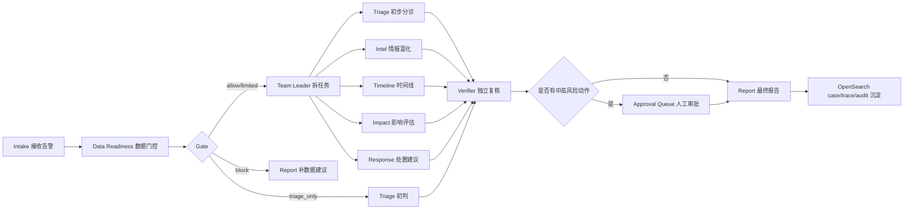

# AI+SOC Agent Team PoC

这是一个从零搭建的半自治 SOC 应急响应 Agent Team 工程化 PoC。它采用层级式专家团队流程：

`Intake -> Data Readiness -> Team Leader -> Triage / Intel / Timeline / Impact / Response -> Verifier -> Approval -> Report`

OpenSearch 被封装在 `OpenSearchAdapter` 后面，首期支持两种模式：

- `DEMO_MODE=true`：不连接真实 OpenSearch，使用内存适配器跑通端到端流程。
- `DEMO_MODE=false`：使用 `opensearch-py` 连接已有 OpenSearch，读取告警/发现索引并写入案件、Agent trace 和审计索引。

## 目录

- `backend/`：FastAPI 后端、Agent workflow、OpenSearch 适配层、测试。
- `frontend/`：React/Vite 分析台，包含案件列表、证据链、Agent 输出、审批队列和最终报告。
- `samples/`：可用于 intake 的样例告警。
- `.env.example`：后端环境变量模板。

## Workflow



每个流程的分工如下：

| 流程 | 负责人 | 作用 | 产物 |
| --- | --- | --- | --- |
| Intake | API/Webhook | 接收 OpenSearch/Wazuh 告警，创建案件 | `case_id`、原始证据引用 |
| Data Readiness | Data Readiness Agent | 判断数据是否足够支撑分析 | `readiness_score`、`gate`、`gaps` |
| Dispatch | Team Leader Agent | 根据 gate 选择专家 Agent | 子任务计划 |
| Triage | Triage Agent | 初步定级和优先级判断 | priority、初判摘要 |
| Intel | Intel Agent | IOC、知识库、历史案例和 playbook 富化 | 情报命中、上下文证据 |
| Timeline | Timeline Agent | 重建事件顺序和关键节点 | 时间线、事件链 |
| Impact | Impact Agent | 评估影响范围和业务风险 | 风险等级、受影响对象 |
| Response | Response Agent | 生成处置建议，不直接执行 | `recommended_actions`、审批要求 |
| Verifier | Verifier Agent | 检查证据链、越权动作和置信度 | policy flags、复核意见 |
| Approval | 人工分析员 | 批准或拒绝中高风险动作 | 审批结果、人工备注 |
| Report | Report Agent | 汇总通过复核的结论 | 最终报告、审计记录 |

## 本地启动

后端：

```powershell
cd backend
python -m venv .venv
.\.venv\Scripts\Activate.ps1
pip install -r requirements.txt
uvicorn app.main:app --reload --host 0.0.0.0 --port 8000
```

前端：

```powershell
cd frontend
npm.cmd install
npm.cmd run dev
```

浏览器打开 `http://localhost:5173`。工具栏从左到右分别是刷新、创建样例案件、运行当前案件。

## OpenSearch 配置

复制 `.env.example` 为 `.env`，按现有平台调整：

```env
DEMO_MODE=false
OPENSEARCH_URL=https://your-opensearch:9200
OPENSEARCH_USERNAME=your-user
OPENSEARCH_PASSWORD=your-password
OPENSEARCH_ALERT_INDEX=wazuh-alerts-*
OPENSEARCH_FINDINGS_INDEX=.opensearch-sap-*
```

内部索引默认规划：

- `soc-cases-v1`：案件状态、readiness、最终报告。
- `soc-agent-traces-v1`：Agent 输入输出、Verifier 结论。
- `soc-knowledge-v1`：playbook、历史案例摘要、RAG 文档。
- `soc-audit-v1`：审批、处置建议、人工反馈。

## API

- `POST /api/v1/cases/intake`：接收告警包，创建案件。
- `POST /api/v1/opensearch/webhook`：OpenSearch Alerting webhook 入口。
- `POST /api/v1/cases/{case_id}/run`：运行 Agent Team。
- `GET /api/v1/cases/{case_id}`：读取案件详情。
- `POST /api/v1/approvals/{action_id}/decision`：审批或拒绝处置建议。

## 测试

```powershell
cd backend
pytest
```

测试覆盖 readiness 打分、OpenSearch 查询构造、端到端 intake -> analysis -> approval，以及高风险动作必须审批的策略。
