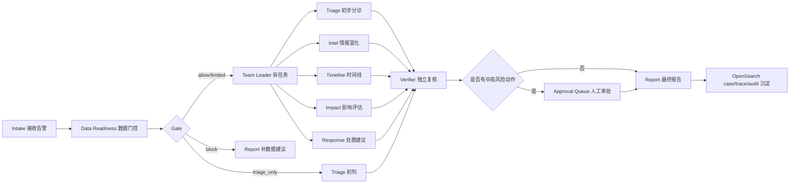

# AI+SOC Agent Team PoC

这是一个从零搭建的半自治 SOC 应急响应 Agent Team 工程化 PoC。它采用层级式专家团队流程：

`Intake -> Data Readiness -> Team Leader -> Triage / Intel / Timeline / Impact / Response -> Verifier -> Approval -> Report`

OpenSearch 被封装在 `OpenSearchAdapter` 后面，首期支持两种数据接口模式：

- `DEMO_MODE=true`：不连接真实 OpenSearch，使用内存适配器保存案件、trace、audit，并提供少量知识库命中。
- `DEMO_MODE=false`：使用 `opensearch-py` 连接已有 OpenSearch，读取告警/发现索引并写入案件、Agent trace 和审计索引。

LLM agent team 是唯一分析路径：配置 `OPENAI_ENABLED=true` 和 `OPENAI_API_KEY` 后，后端会启动多个具备独立角色、技能和工具权限的 OpenAI agent。Team Leader 通过 mailbox 派发任务，Triage/Intel/Timeline/Impact/Response 等专家 agent 主动调用 OpenSearch 工具补证据，Verifier 独立复核，Report 汇总输出。

没有可用 LLM 时，案件运行会失败并写入 audit 事件；项目不再保留旧的确定性离线分析路径。`DEMO_MODE=true` 只代表 OpenSearch/存储使用内存适配器，不代表本地规则分析。

## 目录

- `backend/`：FastAPI 后端、Agent workflow、OpenSearch 适配层、测试。
- `frontend/`：React/Vite 分析台，包含案件列表、证据链、Agent 输出、审批队列和最终报告。
- `samples/`：可用于 intake 的样例告警。
- `.env.example`：后端环境变量模板。

## Agent Runtime

核心代码在 `backend/app/agent_team/`：

- `specs.py`：定义每个 SOC agent 的角色、目标、必需 skills 和可用工具。
- `skills/`：类似 Claude Code skill 的 Markdown 能力包，例如 triage、threat_intel、timeline、response_policy、verification。
- `tools.py`：工具注册表，暴露 mailbox 和 OpenSearch API 给 LLM agent 调用。
- `mailbox.py`：agent 间通信通道，前端 Team Mailbox 面板会展示这些消息。
- `runner.py`：多 agent harness，负责创建每个 agent 的 messages、执行工具调用 loop、收集结构化输出和 trace。

也就是说，这不是“一个 prompt 输出多个章节”，而是多个 agent 独立运行、共享案件上下文、通过 mailbox 通信，并把 OpenSearch 当作可调用工具使用。

## Workflow



每个流程的分工如下：

| 流程 | 负责人 | 作用 | 产物 |
| --- | --- | --- | --- |
| Intake | API/Webhook | 接收 OpenSearch/Wazuh 告警，创建案件 | `case_id`、原始证据引用 |
| Data Readiness | Data Readiness Agent | 判断数据是否足够支撑分析 | `readiness_score`、`gate`、`gaps` |
| Dispatch | Team Leader Agent | 根据 gate 选择专家 Agent | 子任务计划 |
| Triage | Triage Agent | 初步定级和优先级判断 | priority、初判摘要 |
| Intel | Intel Agent | IOC、知识库、历史案例和 playbook 富化 | 情报命中、上下文证据 |
| Timeline | Timeline Agent | 重建事件顺序和关键节点 | 时间线、事件链 |
| Impact | Impact Agent | 评估影响范围和业务风险 | 风险等级、受影响对象 |
| Response | Response Agent | 生成处置建议，不直接执行 | `recommended_actions`、审批要求 |
| Verifier | Verifier Agent | 检查证据链、越权动作和置信度 | policy flags、复核意见 |
| Approval | 人工分析员 | 批准或拒绝中高风险动作 | 审批结果、人工备注 |
| Report | Report Agent | 汇总通过复核的结论 | 最终报告、审计记录 |

## 本地启动

后端：

```powershell
cd backend
python -m venv .venv
.\.venv\Scripts\Activate.ps1
pip install -r requirements.txt
uvicorn app.main:app --reload --host 0.0.0.0 --port 8000
```

前端：

```powershell
cd frontend
npm.cmd install
npm.cmd run dev
```

浏览器打开 `http://localhost:5173`。工具栏从左到右分别是刷新、创建样例案件、运行当前案件。

## LLM 和 OpenSearch 配置

复制项目根目录的 `.env.example` 为 `.env`，按现有平台调整。后端会同时读取项目根目录 `.env` 和 `backend/.env`：

```env
OPENAI_ENABLED=true
OPENAI_API_KEY=sk-...
OPENAI_MODEL=gpt-4o-mini
SILICONFLOW_MODEL=deepseek-ai/DeepSeek-V4-Flash

DEMO_MODE=false
OPENSEARCH_URL=https://your-opensearch:9200
OPENSEARCH_USERNAME=your-user
OPENSEARCH_PASSWORD=your-password
OPENSEARCH_ALERT_INDEX=wazuh-alerts-*
OPENSEARCH_FINDINGS_INDEX=.opensearch-sap-*
```

OpenAI 相关配置只放在后端 `.env`，不要放进前端环境变量或浏览器代码。`/health` 会返回 `analysis_mode`、`openai_enabled`、`openai_configured`、`openai_model` 和 `llm_required`。配置成功后 `analysis_mode` 应为 `multi_agent_llm_team`；未配置时为 `llm_agent_team_unconfigured`，运行案件会返回失败。

OpenSearch 当前被当作外置分析插件的数据接口预留：`OpenSearchAdapter` 提供 `search_events`、`get_document`、`aggregate_timeline`、`search_findings_or_alerts`、`vector_search_context` 以及写回 case/trace/audit 的接口。LLM agent 可以主动调用这些工具进行分析，但不会直接执行处置动作。

内部索引默认规划：

- `soc-cases-v1`：案件状态、readiness、最终报告。
- `soc-agent-traces-v1`：Agent 输入输出、Verifier 结论。
- `soc-knowledge-v1`：playbook、历史案例摘要、RAG 文档。
- `soc-audit-v1`：审批、处置建议、人工反馈。

## API

- `POST /api/v1/cases/intake`：接收告警包，创建案件。
- `POST /api/v1/analyze`：外置插件单次入口，接收告警并立即运行多 agent SOC team 分析。
- `POST /api/v1/opensearch/webhook`：OpenSearch Alerting webhook 入口。
- `POST /api/v1/cases/{case_id}/run`：运行 Agent Team。
- `GET /api/v1/cases/{case_id}`：读取案件详情。
- `POST /api/v1/approvals/{action_id}/decision`：审批或拒绝处置建议。

## 测试

```powershell
cd backend
pytest
```

测试使用 fake OpenAI client 覆盖 LLM agent team harness、OpenSearch 查询构造、端到端 intake -> analysis -> approval，以及高风险动作必须审批的策略。
