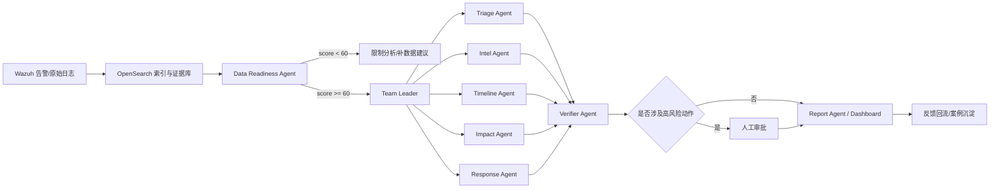
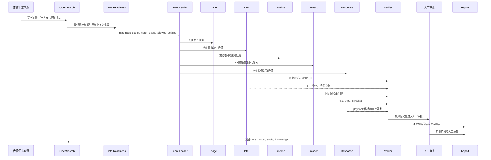
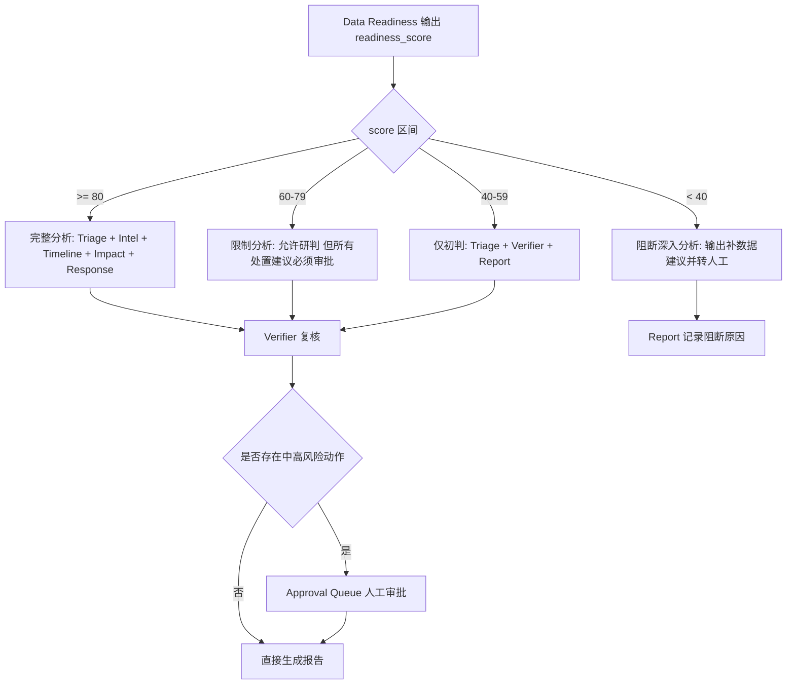
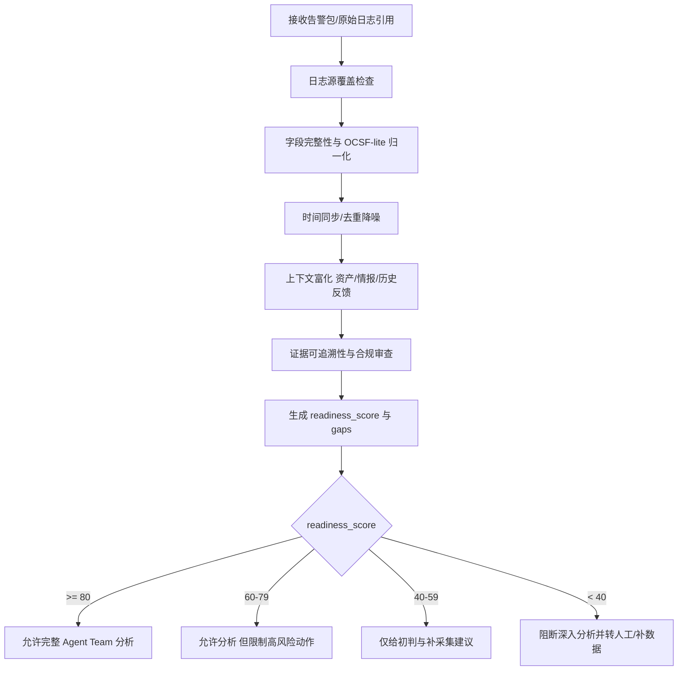

### AI+SOC 的主要落地形式

上传的 Markdown 已经把 AI+SOC 的**主要落地形式划分为三类**，这一结构可以直接沿用。第一类是 **Assistant / Copilot enhancement**，即 AI 主要作为搜索、解释、摘要和问答助手，不直接驱动复杂流程；第二类是 **Agent Team / Semi-autonomous SOC**，即多个具备专长的 Agent 在受控工作流下协作完成分诊、研判、取证、报告等任务；第三类是 **Full or near-autonomous SOC**，即更高程度的自动执行与自动响应。就你当前文档的技术路线而言，主方案显然落在第二类，而不是第三类。

### **Agent Team 的工作流与功能分工**

上传 Markdown 中对 Agent Team 的工作流划分为七步：**Intake/Triage、Context retrieval、Timeline/Event stitching、Hypothesis building、Recommended action / playbook trigger、Report/Case summary、Human approval / feedback loop**

在实现层面，OpenSearch 官方文档已经具备与该流程高度 compatible 的能力组件：agents/tools 可完成调度与工具调用，vector search 可承载 RAG 检索，Security Analytics 提供 detectors、findings、alerts 与 correlation engine，agentic memory 可作为持久化上下文；Wazuh 官方文档则提供 OpenSearch 集成与可触发的 Active Response。([docs.opensearch.org](https://docs.opensearch.org/latest/ml-commons-plugin/agents-tools/index/))

#### 架构比较表

| 架构模式           | 组织方式                                                   | 核心角色                                                     | 主要交互流程                                                 | 关键技术栈                                                   | 优点                                       | 局限                                       | 用途定位                   |
| ------------------ | ---------------------------------------------------------- | ------------------------------------------------------------ | ------------------------------------------------------------ | ------------------------------------------------------------ | ------------------------------------------ | ------------------------------------------ | -------------------------- |
| 层级式专家团队     | 主 Agent 统一拆解与调度，专家 Agent 按职责执行             | Team Leader、Data Readiness、Triage、Intel、Timeline、Impact、Response、Report、Verifier | 告警进入 → Data Readiness 门控 → Team Leader 调度专家 → Verifier 复核 → 人工审批 → 输出/回流 | Wazuh、OpenSearch、LangGraph、FastAPI、Redis Streams/Kafka、Dashboard | 与原文最一致；职责清楚；最适合国创答辩展示 | Team Leader 可能成为瓶颈；需要良好任务拆解 | **主架构**                 |
| 路由式专家团队     | Router 先判定案件类型，再调用对应专家                      | Router、Triage、Intel、Timeline、Report、Verifier            | 输入案件 → Router 分类 → 调用一个或多个专家 → 汇总输出 → 复核 | OpenSearch 检索/向量搜索、Router、结构化输出                 | 简洁、并行性好、利于对照实验               | 路由错误会放大下游误差                     | **对照架构**               |
| 黑板式共享记忆团队 | 所有 Agent 面向共享 case-memory / evidence-ledger 异步协作 | Shared Memory、Evidence Writer、Conflict Resolver、Verifier  | 告警入黑板 → 各 Agent 异步补写证据/观点 → 冲突消解 → 形成结论 | OpenSearch agentic memory、共享索引、事件总线                | 多源融合能力强，适合长期记忆研究           | 实现复杂、调试困难、权限边界难设计         | **对照架构**               |
| 双流程编排式       | 机器剧本流 + 人工服务流分离                                | Team Leader、专家 Agent、审批人、回滚节点                    | 机器完成可确定步骤 → 人工审批高风险动作 → 审计回滚 → 输出    | Workflow 引擎、Wazuh Active Response、OpenSearch Security/RBAC | 最贴合真实运营与合规要求                   | 流程设计成本高                             | 【建议】适合后续工程化对接 |

主方案采用层级式角色分工，路由式与黑板式仅作为研究比较和答辩对照。([docs.langchain.com](https://docs.langchain.com/oss/python/langchain/multi-agent))

#### **主架构说明**

本项目主架构明确采用**层级式专家团队**。其原因不是“层级式最先进”，而是它与原文的角色列表和流程图最一致：Data Readiness 负责前置门控，Team Leader 负责任务拆解与状态协调，Triage/Intel/Timeline/Impact/Response/Report 负责专长处理，Verifier 负责独立复核，人工节点负责高风险动作审批。该结构既保留了多 Agent 的专业化，又维持了较强的可审计性和可展示性。



该主流程与“先质检、再调度、后复核”的逻辑一致；其中 OpenSearch 适合作为 evidence refs、统一索引与上下文检索底座，Wazuh 则提供告警来源与可选的 Active Response 执行能力。([docs.opensearch.org](https://docs.opensearch.org/latest/security-analytics/))

#### **Workflow 逐流程解释**

本项目的 workflow 不是一个 Agent 一次性完成所有分析，而是把 SOC 应急响应拆成多个受控节点。每个节点只处理自己的职责，并把结构化结果交给下一个节点。这样可以把“谁发现了什么、基于哪些证据、是否允许处置、是否需要人工审批”完整记录下来。



| 流程节点 | 负责 Agent/模块 | 输入 | 处理逻辑 | 输出 | 是否可自动执行 |
| --- | --- | --- | --- | --- | --- |
| 1. Intake | API / Webhook | Wazuh/OpenSearch 告警、finding、原始日志引用 | 创建 `case_id`，保存原始 payload，绑定 `index/doc_id` 作为 evidence ref | `case_packet` | 是 |
| 2. Data Readiness | Data Readiness Agent | `case_packet`、原始日志字段、证据引用 | 检查时间、严重性、实体、字段完整性、证据可追溯性 | `readiness_score`、`gate`、`gaps`、`allowed_actions` | 是 |
| 3. Gate 判断 | Workflow | `readiness_report` | 按分数决定完整分析、限制分析、仅初判或阻断 | `allow/limited/triage_only/block` | 是 |
| 4. 任务拆解 | Team Leader Agent | 案件、readiness、可用专家列表 | 选择需要调用的专家 Agent，不直接编造威胁结论 | 子任务计划 | 是 |
| 5. 初步分诊 | Triage Agent | 告警、严重性、历史相似事件 | 判断优先级、是否值得继续调查、初步假设 | `priority`、初判摘要、下一步建议 | 是 |
| 6. 情报富化 | Intel Agent | IOC、IP/域名、资产标签、知识库 | 查询内部知识库、威胁情报、历史案例和 playbook | IOC 命中、TTP 提示、上下文证据 | 是 |
| 7. 时间线重建 | Timeline Agent | 多条告警、时间窗、主机/账号/IP | 聚合事件、排序、拼接关键转折点 | 时间线、事件链、关键节点 | 是 |
| 8. 影响评估 | Impact Agent | 时间线、资产、账号、业务标签 | 估算影响范围、资产重要度和业务风险 | 风险等级、受影响对象清单 | 是 |
| 9. 处置建议 | Response Agent | readiness、风险等级、策略边界 | 只生成建议和 playbook 候选，不直接执行隔离/封禁/停账号 | `recommended_actions`、`needs_human_approval` | 否，高风险必须审批 |
| 10. 独立复核 | Verifier Agent | 所有专家输出、证据链、审批规则 | 检查证据是否支撑结论、动作是否越权、置信度是否合理 | 通过/驳回、policy flags、补证据要求 | 是 |
| 11. 人工审批 | Analyst / SOC Lead | Response 建议、Verifier 结果、证据链 | 对隔离主机、封禁 IP、停账号等动作批准或拒绝 | 审批结果、人工备注 | 人工决定 |
| 12. 报告沉淀 | Report Agent | 专家结论、Verifier 意见、审批结果 | 生成案件报告，写回 OpenSearch case/trace/audit/knowledge | 最终报告、审计记录、案例沉淀 | 是 |

##### 关键分支



##### 各 Agent 的边界

- Data Readiness 只判断数据是否足够，不判断攻击是否成立。
- Team Leader 只负责任务拆解和状态协调，不直接给威胁结论。
- Triage 只做优先级和初判，不做最终定性。
- Intel 只做 IOC、情报、历史案例和 playbook 富化。
- Timeline 只重建事件顺序，不扩展没有证据支持的链条。
- Impact 只评估影响范围和业务风险。
- Response 只给处置建议，不直接执行高风险动作。
- Verifier 只复核证据链、策略边界和审批要求。
- Report 只汇总已通过复核的内容，并保留局限性与待确认事项。

#### **Data Readiness 流程**

Data Readiness Agent 是主方案中最关键的前置门。其作用不是直接输出威胁结论，而是判断“**当前数据是否足以支撑后续分析**”以及“**系统允许做到哪一步**”。



这一流程与 OCSF 的统一事件模型思想、MITRE ATT&CK 的 data source 视角、OWASP 对结构化输出/最小权限/HITL 的要求是相容的。([ocsf.io](https://ocsf.io/))

#### 【建议】统一结构化输出封套

下列结构化输出封套不改变原文主方案，只是把原文中的 evidence refs、置信度、下一步动作、审批要求等要求形式化，便于开发和答辩展示。([cheatsheetseries.owasp.org](https://cheatsheetseries.owasp.org/cheatsheets/AI_Agent_Security_Cheat_Sheet.html))

```json
{
  "agent": "triage",
  "case_id": "CASE-2026-001",
  "task_id": "TASK-001",
  "readiness_gate": "allow|limited|block",
  "summary": "一句话结论",
  "key_findings": [],
  "evidence_refs": [
    {
      "source": "wazuh-alerts-4.x*",
      "doc_id": "alert-123",
      "reason": "为何支撑该结论"
    }
  ],
  "confidence": 0.0,
  "recommended_actions": [],
  "policy_flags": [],
  "needs_human_approval": true
}
```

#### **【建议】主架构 Agent 规格表(111)**

以下职责与角色名称沿用原文；输入/输出契约、提示骨架、量化指标与验收标准属于【建议】补充，用于把原文方案变成可实现的工程规格。

| Agent          | 原文职责                                 | 【建议】输入契约                                          | 【建议】输出契约                                             | 【建议】示例提示骨架                                         | 关键技术栈                                     | 【建议】量化指标与验收标准                               |
| -------------- | ---------------------------------------- | --------------------------------------------------------- | ------------------------------------------------------------ | ------------------------------------------------------------ | ---------------------------------------------- | -------------------------------------------------------- |
| Team Leader    | 统一接案、拆任务、协调专家、汇总结果     | `case_packet`、`readiness_report`、专家能力列表、历史状态 | 任务分解、子任务路由、最终汇总草案                           | “你是 Team Leader。仅根据 readiness_gate 与可用专家拆解任务；禁止直接补造证据。” | LangGraph/状态机、OpenSearch 检索、任务队列    | 路由正确率≥90%；无效委派率≤5%；高风险任务必须送 Verifier |
| Data Readiness | 对数据质量、覆盖度、可追溯性与合规性评分 | 告警包、日志源清单、字段映射、原始日志引用                | `readiness_score`、`gaps`、`allowed_actions`、`confidence_cap` | “你只判断数据是否足够，不输出攻击确定性结论。”               | OCSF-lite 映射、OpenSearch、规则校验、脱敏流程 | 缺失字段识别召回≥90%；证据追溯覆盖≥99%；敏感信息泄露率=0 |
| Triage         | 初步定级、判断是否值得进入完整分析       | 案件摘要、readiness、核心告警、历史相似事件               | 初步优先级、简要假设、下一步建议                             | “先给出优先级与是否继续调查，不要越过证据边界。”             | Wazuh 告警、OpenSearch Security Analytics      | 初判准确率≥85%；p95 延迟<5s                              |
| Intel          | 威胁情报/IOC/资产背景补充                | IOC、IP/域名、资产标签、外部/内部情报索引                 | IOC 命中、资产上下文、相关 TTP 提示                          | “仅做情报富化与背景查询，输出命中与来源。”                   | OpenSearch threat intel / vector search        | 富化命中率≥80%；误富化率≤5%                              |
| Timeline       | 聚合事件、重建时间线与案件脉络           | 多条告警、日志窗口、主机/账号/网络实体                    | 时间线、事件聚合结果、关键转折点                             | “按时间顺序组织事件，只输出可由 evidence_refs 支撑的链条。”  | OpenSearch 聚合、相关性分析、时间窗拼接        | 案件聚合准确率≥85%；时间线完整率≥80%                     |
| Impact         | 评估影响范围、资产重要度、业务风险       | 资产信息、时间线、IOC、账号/主机关系                      | 风险级别、影响范围、受影响对象清单                           | “从资产和业务角度评估影响，不把推测写成事实。”               | 资产台账、OpenSearch 检索                      | 风险评级与人工一致率≥80%                                 |
| Response       | 给出处置建议或触发 playbook              | readiness、Verifier 结果、风险等级、策略边界              | 处置建议、可执行动作列表、审批要求                           | “只产出处置建议；若动作高风险，必须标记 needs_human_approval=true。” | Wazuh Active Response、RBAC、策略白名单        | 越权动作率=0；需审批动作漏标率=0                         |
| Report         | 生成案件摘要、答辩可展示文本与结构化报告 | 所有专家输出、Verifier 审核意见、审批状态                 | 最终报告、摘要、图表要点、证据附注                           | “报告必须包含结论、证据、局限、待确认事项四部分。”           | 模板引擎、Dashboard、结构化输出                | 报告完整率≥90%；evidence_refs 覆盖≥95%                   |
| Verifier       | 独立复核结论、检查证据链与策略一致性     | Team Leader 汇总、专家输出、审批规则                      | 通过/驳回意见、证据不足说明、风险标记                        | “你不负责新结论，只负责复核：证据是否充分、动作是否合规。”   | OWASP 规则、OpenSearch Security、审计日志      | 不可证结论拦截率≥90%；高风险未审批放行率=0               |
